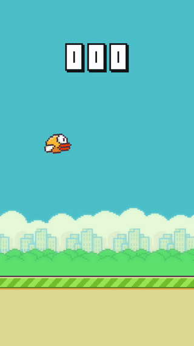

# flutter_bird

Clone of Flappy Bird game written on Flutter.

 

## Intro

This is silly attempt to learn the new mobile framework.

If you remember, there was a game called Flappy Bird. At that time it was a best time killer app. I was a fan back in days. Anyway, it is not a full clone of the game. It's just repeating some basic mechanics and graphics.

The game has built on [Flutter](https://github.com/flutter/flutter) and [Flame](https://github.com/luanpotter/flame) game engine.

I haven't tried many features from standart library like Streams or even Net stack. So, I can't fully compare an experience with other languages and frameworks. Anyway, I'm looking forward to use more features in my next apps!